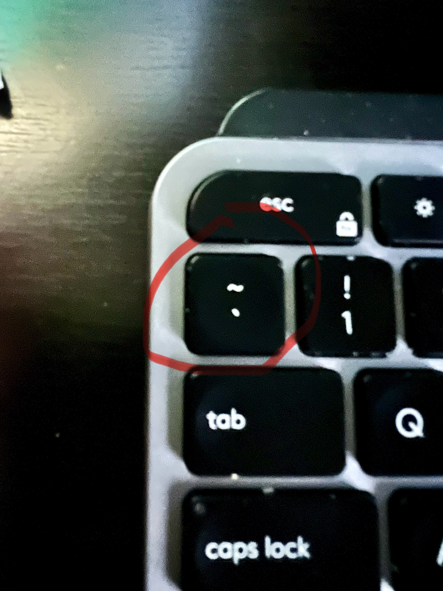
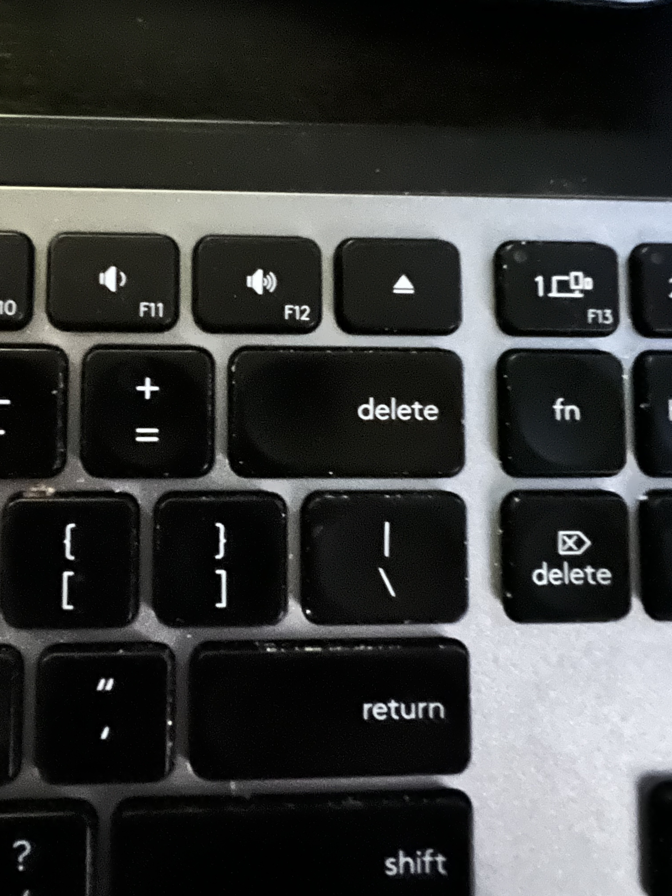

# Writing Good Documantation

## Step 1 - Using Codeblocks

Codeblocks in markdown make it *very easy* for tech people to __copy, paste, and share__ code.
A good __Cloud Engineer__ uses Codeblocks whenever possible.

Becasue it allows other to copy and paste their code to replicate or research an issue.


- In order to create codeblocks in markdown you need to use three backticks (`)
- Not to be confussed with quotation (')


```
# Define a Person Class
Class Person
  #  Constructor
def initialize(name, age)
  @name = name  #  Instance variable for the person's name
  @age  =  age  #  Instance variable for the peerson's age
end

#  Instance method to return a greeting
def greeting
  "Hello, my name is #{@name} and I am #{@age} years old."
  end
end
```

-  When you can you should attempt to apply syntax highlighting to your codeblocks

  ```ruby
# Define a Person Class
Class Person
  #  Constructor
def initialize(name, age)
  @name = name  #  Instance variable for the person's name
  @age  =  age  #  Instance variable for the peerson's age
end

#  Instance method to return a greeting
def greeting
  "Hello, my name is #{@name} and I am #{@age} years old."
  end
end
```

-  Make note of where the backtick button is located. It should appear above the tab key
-  But it may vary based on your keyboard layout



Good Cloud Engineers use codeblocks for Code and Errors that appear in the console.

```bash
Traceback (most recent last call):
        2: from /usr/bin/irb:23:in `<main>'
        1: from (irb):1
RuntimeError: This is a custom error message
```

>  Here is an example of using a codeblock for an error that appears in bash.

When you can always provide a codeblock instead of a screenshot.
If you need to take a screenshot make sure it is not a photo from your phone.

>  There are certain cases where it is ok to take photos with your phone, this is when you are showing something like a keyboard that does not show on a computer screen. If it is rendered on your computer screen you should take a screen shot

##  Step 1 - How to take screenshots

To take screenshots on both MacOS and Windows, you can use hotkeys or keyboard shortcuts. Here are the common hotkeys for taking screenshots on both operating systems:

**On MacOS:**
1. **Capture the entire screen:** Press `Command (⌘) + Shift + 3`. The screenshot will be saved to your desktop by default.
2. **Capture a selected portion of the screen:** Press `Command (⌘) + Shift + 4`, and then drag to select the area you want to capture. Release the mouse button to take the screenshot.
3. **Capture a specific window:** Press `Command (⌘) + Shift + 4`, followed by the `Spacebar`. Click on the window you want to capture.

You can also use various combinations with the Control key (`Ctrl`) or other modifier keys to copy the screenshot to the clipboard or change the destination.

**On Windows:**
1. **Capture the entire screen:** Press `PrtScn` (Print Screen) key to capture the entire screen. The screenshot is copied to the clipboard, and you can paste it into an image editor (e.g., Paint) to save it.
2. **Capture the active window:** Press `Alt + PrtScn` to capture only the active window. The screenshot is copied to the clipboard.
3. **Capture a specific portion of the screen (Windows 10 and later):** Press `Shift + Windows key + S` to open the Snip & Sketch tool, which allows you to select a portion of the screen and save it to your clipboard or annotate it.
4. **Capture the entire screen and save it as a file (Windows 10 and later):** Press `Windows key + Shift + S` to capture the entire screen, open the Snip & Sketch tool, and select the area you want to capture. The screenshot is copied to your clipboard, and you can paste it into the Snip & Sketch app to save it.

Please note that the specific key combinations or tools may vary depending on your Windows version, as Microsoft has introduced new screenshot features in recent updates. The options mentioned here should work for Windows 10 and later.

##  Step 3 Use Github Flavored Makrdown Task List

Github extends Markdown to have a list where you can check off items [<sup>[3]</sup>](#external-references)

-  [X]  Finish Step 1
-  [ ]  Finish Step 2
-  [ ]  Finish Step 3

##  Step 4 Use Github Flavored Makrdown Use Emoji 
Github Flovered markdown (GFM) supports emoji shortcodes. [<sup>[4]</sup>](#external-references)

Here are some examples:

| Name | Code | Emoji |
| ---- | ---- | ----- |
| cloud with lighting and rain  | `:cloud_with_lightning_and_rain:`  | ⛈️    |
| wind face | `:wind_face:`  | :wind_face:   |
| tornado  | `:tornado:`  |🌪️   |

##  Step 5 How to create a table 

You can use the following markdown format to create tables: 

```md
| Name | Code | Emoji |
| ---- | ---- | ----- |
| cloud with lighting and rain  | `:cloud_with_lightning_and_rain:`  | ⛈️    |
| wind face | `:wind_face:`  | :wind_face:   |
| tornado  | `:tornado:`  |🌪️   |
```

Github extends the functionality of Markdown Tables to provide more aligment and table cell formatting options. [<sup>[5]</sup>](#external-references)


-  Make note of where the pipe character is located. It should appear above the return key
-  But it may vary based on your keyboard layout



[Secret Window Hidden Garden](secret-window/hidden-garden.md)


##  External References
-  [Github Flavored Markdown Spec](https://github.github.com/gfm/) <sup>[1]</sup>
-  [Basic writing and formatting syntax (Github Flavored Markdown)](https://docs.github.com/en/get-started/writing-on-github/getting-started-with-writing-and-formatting-on-github/basic-writing-and-formatting-syntax) <sup>[2]</sup>
-  [GFM - Task List ](https://docs.github.com/en/get-started/writing-on-github/working-with-advanced-formatting/about-task-lists) <sup>[3]</sup>
-  [GFM - Emoji CheatSheet ](https://github.com/ikatyang/emoji-cheat-sheet) <sup>[4]</sup>
-  [GFM - Tables (with extensions) ](https://github.github.com/gfm/#tables-extension-) <sup>[5]</sup>

